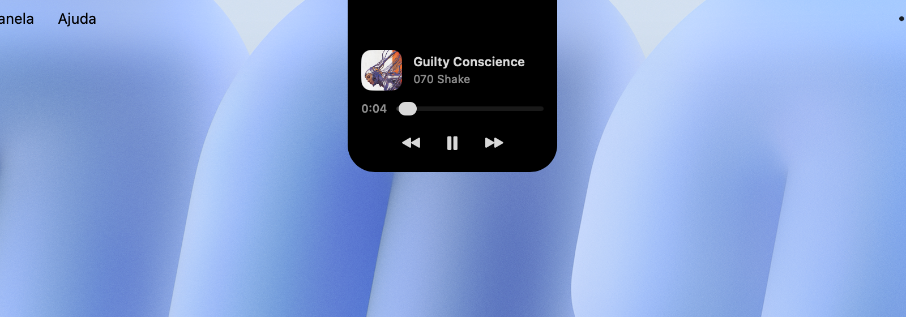
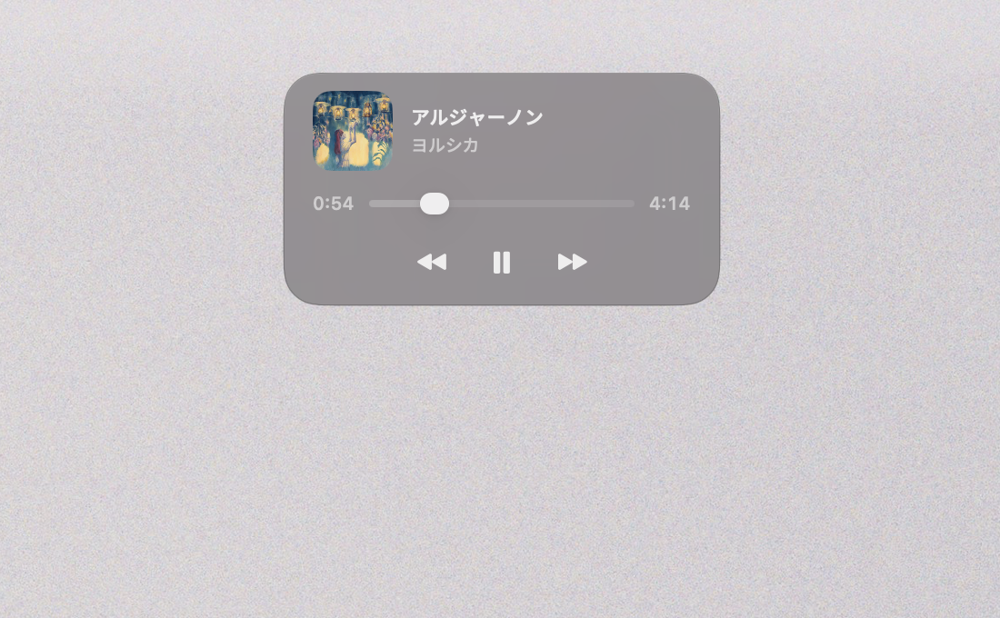
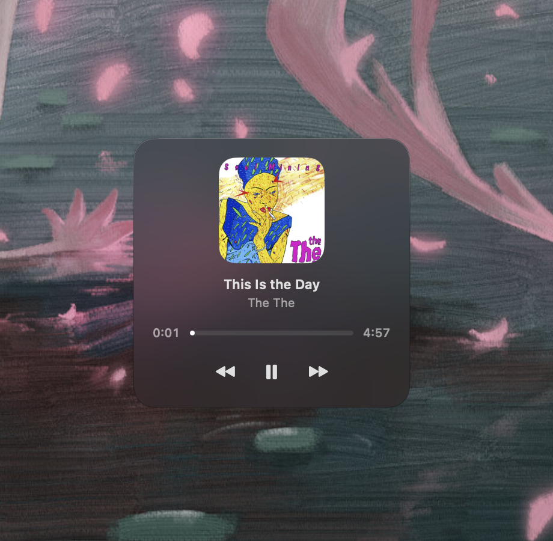
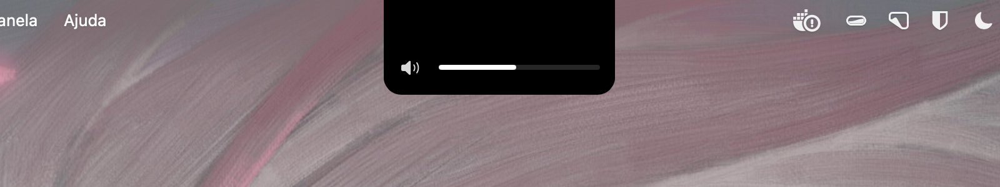
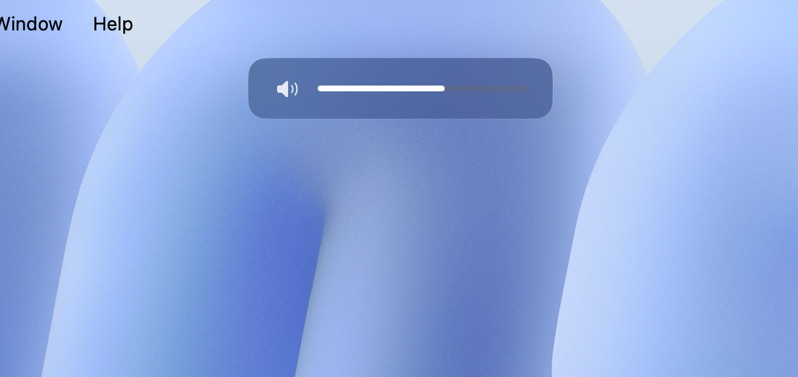
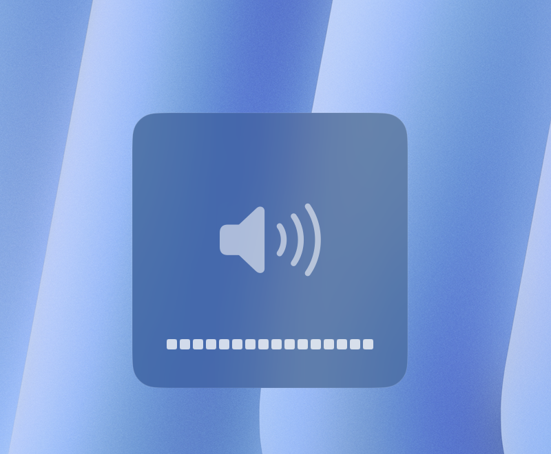

<!-- The bold tagline and the subtitle below it are final (author's pick). -->

<p align="center">
  
</p>

<h1 align="center">Crema</h1>

<p align="center"><strong>A quiet companion for your Mac's notch. Native and out of the way.</strong></p>

<p align="center">
It shows what's playing: album art, a touch of its color, and the controls you
reach for. Volume, brightness, and keyboard backlight get their own HUDs,
optionally replacing the system's.
</p>

<p align="center">
  
  
  
</p>

<p align="center">
  <a href="https://github.com/colatte/crema/releases/latest/download/Crema.dmg">
    
  </a>
  <br>
  <sub>Free &amp; open source · then just drag it into Applications (<a href="#installation">guide</a>)</sub>
</p>

<p align="center">
  
</p>

---

## Screenshots

| Notch | Card | Classic |
| :---: | :---: | :---: |
|  |  |  |

The HUDs, in the same three voices — the thin capsule at the notch and on the
card, and the classic's segmented bezel:

| Volume at the notch | Volume on the card | Classic segments |
| :---: | :---: | :---: |
|  |  |  |


## Features

- **Now playing at the notch.** Album artwork, a subtle accent color drawn from
  it, and the essentials: play/pause, previous, next, and a scrubber you can drag.
- **Its own volume and brightness HUDs.** Screen brightness, keyboard backlight,
  and volume get a HUD that matches the rest — optionally replacing the system's.
- **Three styles.** _Notch_ expands the cutout, _card_ floats a rounded panel
  near the top, and _classic_ is a quieter take on the native bezel, sitting
  centered near the bottom where the system's HUD always lived. Pick the one you
  like — it applies to every display, and a display without a notch renders
  _notch_ as _card_.
- **Two indicator looks for the card.** The HUD level reads as a thin _line_
  (the default) or fills the whole card — pick in Settings → General.
- **Shows up when it's useful.** Crema surfaces briefly when the track changes,
  then tucks away. Hover to hold it open; click to reach the controls.
- **Native and light.** Built with SwiftUI and AppKit, it lives in the menu bar
  with no Dock icon, and stays out of the way when you don't need it.
- **Speaks your language.** English and Brazilian Portuguese, following the
  system.
- **Configurable.** A standard Settings window covers the style, now-playing
  behavior, the System HUD toggle, permissions, launch at login — and an About
  tab with the version and links.

## What Crema is

Crema does a few things — music, volume, brightness — and tries to do them well,
natively, without asking for your attention. It sits by the notch and waits. That
focus is deliberate: no widgets, no file shelf, no calendar, no drag-and-drop.
If those are what you're after, Crema isn't trying to be that app.

And that's fine — a few good ones already are:

- **[Boring Notch](https://github.com/TheBoredTeam/boring.notch)** — open source,
  and far more expansive: widgets, a file shelf, calendar, and heavy customization.
- **[Alcove](https://tryalcove.com)** — a polished, expressive paid app with a lot
  of character in how it animates the notch.
- **[MediaMate](https://wouter01.github.io/MediaMate/)** — a mature paid app if you
  want the essentials plus a broader feature set.

All good work. Crema just aims at a smaller target.

Curious what might come next? See the [roadmap](ROADMAP.md).

## Requirements

- macOS 14 (Sonoma) or later.
- Apple Silicon or Intel.
- A Mac with a notch for the _notch_ style — on a Mac without one, Crema renders
  it as _card_. The _card_ floats near the top of the screen; _classic_ sits
  centered near the bottom. Both work the same on any Mac.
- The **Accessibility** permission, if you want Crema to handle the volume and
  brightness keys (see [Usage](#usage)). Crema runs without it: the volume HUD
  still appears when the level changes, and the app works normally otherwise —
  but the brightness HUDs need the keys to know a change was yours (they stay
  quiet for the ambient-light sensor), and the system's own HUDs can't be
  replaced.

## Installation

1. Download the latest [`Crema.dmg`](https://github.com/colatte/crema/releases/latest/download/Crema.dmg) —
   or browse all [Releases](https://github.com/colatte/crema/releases).
2. Open it and drag **Crema** into your Applications folder.
3. Launch Crema. It lives in the menu bar — look for its icon up top, not in the Dock.
4. When asked, grant **Accessibility** in System Settings so Crema can handle the
   volume and brightness keys. You can also do this later from Settings → Permissions.

### First launch

> [!NOTE]
> Crema isn't notarized by Apple yet (that needs a paid Apple Developer
> account — it's on the [roadmap](ROADMAP.md)), so the first time you open it
> macOS warns that it's from an "unidentified developer." That's expected —
> nothing is wrong with the app, and you only need to do this once.

There are two ways to get past it:

**System Settings — the built-in way.** Try to open Crema, dismiss the warning,
then open **System Settings → Privacy & Security**, scroll to the note about
Crema, and click **Open Anyway** — confirm once more and it opens.

**Terminal — if the button doesn't appear** (some managed or non-admin accounts):

```bash
xattr -dr com.apple.quarantine /Applications/Crema.app
```

## Usage

- **Play something.** When the track changes, Crema shows it near the notch for a
  moment, then tucks away.
- **Hover** the notch to hold it open; **click** it to open the controls —
  play/pause, previous, next, and the scrubber.
- **Press a volume or brightness key** and Crema's HUD appears in the style you
  picked.
- To have Crema **replace the system's HUDs**, turn that on in
  **Settings → System HUD**. Crema then intercepts the volume and brightness
  keys — the system never sees them, so it never draws its HUD; Crema shows its
  own and applies the change itself. It's off by default, reversible at any
  time, and needs the Accessibility permission. If one channel ever fails to
  apply — say a Bluetooth output disappears mid-press — only that channel
  (volume, screen brightness, or keyboard backlight) hands its keys back to the
  system, so you're never left without control; it re-engages on its own once
  the channel recovers, and the menu bar tells you if it doesn't. Changes made
  elsewhere — Control Center, another app, a keyboard Crema can't intercept —
  still show the system's own HUD. Turn it off (or quit Crema) and the native
  HUDs come right back.
- **If one kind of key seems ignored** — say the volume HUD appears but the
  brightness one never does — another app is most likely taking those keys before
  Crema. Utilities that drive brightness themselves do this by design
  (BetterDisplay's combined brightness, MonitorControl and friends), and which app
  wins is decided at login, so it can differ from one boot to the next. Crema
  names the app in its menu when it happens. Two apps can't own the same key:
  either turn that feature off in the other app, or let it keep the key.
- The **menu bar icon** opens Settings (`⌘,`), checks for updates, or quits.

## Privacy

Crema runs entirely on your Mac. It reads now-playing information locally through
a vendored out-of-process bridge and, with your permission, watches the volume and
brightness keys. There are no accounts and no analytics. The only network access
is the optional update check: **Check for Updates…** in the menu bar (or automatic
checks, if you consent when asked) fetches the release feed from GitHub Pages.
Nothing else leaves your machine.

## Build from source

Requirements: **Xcode 16** or later (Crema's tests use Swift Testing). The app
targets macOS 14 and builds with the macOS SDK bundled with Xcode.

```bash
git clone https://github.com/colatte/crema.git
cd crema
open Crema.xcodeproj
```

Select the **Crema** scheme and press `⌘R`. To run the tests, press `⌘U`.

## Contributing

Bug reports and pull requests are welcome. See [CONTRIBUTING.md](CONTRIBUTING.md)
for how to file an issue and what a good pull request looks like.

## License

Crema is free software licensed under the **GNU General Public License v3.0**.
See [LICENSE](LICENSE) for details.

## Acknowledgments

Crema vendors **[mediaremote-adapter](https://github.com/ungive/mediaremote-adapter)**
by Jonas van den Berg and contributors (BSD-3-Clause), which reads now-playing
state out of process — the only reliable way to do so on current macOS. Its
license is included at [`ThirdParty/mediaremote-adapter/LICENSE`](ThirdParty/mediaremote-adapter/LICENSE).

Crema was written from scratch, but several open-source projects in this space
were studied as references for approach and behavior — no code was copied from
them. Thanks to the people behind
[SlimHUD](https://github.com/AlexPerathoner/SlimHUD),
[Boring Notch](https://github.com/TheBoredTeam/boring.notch),
[MewNotch](https://github.com/monuk7735/mew-notch),
[Atoll](https://github.com/Ebullioscopic/Atoll), and
[volumeHUD](https://github.com/dannystewart/volumeHUD) for building in the open.

---

Made by Victor, under
**[Colatte](https://colatte.io)** · [github.com/colatte](https://github.com/colatte)

If Crema is useful to you, you can support the work:

[](https://ko-fi.com/colatteio)
